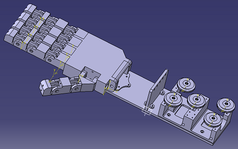

# RobotHand

Robot hand designed with Catia.
It is accompanied with an android program to control each finger's servomotor through bluetooth.

Read Rapport_Projet_S4_Troisemaine_Levieux.pdf for more details.

## Demonstration video

## License

This project is released under the MIT license. See the LICENSE file for more information.
